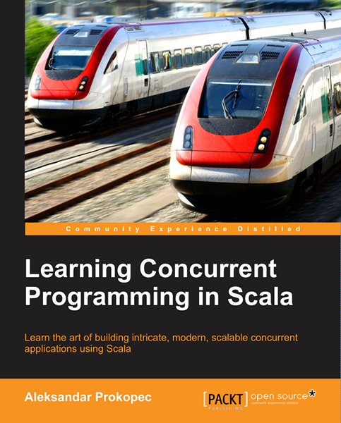

Learning Concurrent Programming in Scala
========================================

This repository contains the complete examples for the books Learning Concurrent Programming in Scala, published by Packt.

